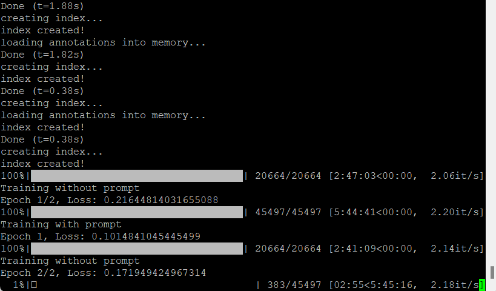

# CS-GY-6613-Project

## File Structure
```
.
│   .dockerignore       # <DockerRelated>
│   .gitignore          #
│   compose.yaml        #
│   Dockerfile          # </DockerRelated>
│   Readme.md
│   requirements.txt    # pip requirements
│
├───data    # folder containing sidewalk data (will be created when running scripts)
│
├───images  # Screenshots for results
│
├───models  # checkpoints for finetuned model (will be created when running scripts)
│       finetune_sam_base_epoch_001.pt
│
└───src
        FinetuneSAM.ipynb       # Finetune using Jupyter Notebook
        FinetuneSAM_Colab.ipynb # Finetune using Google Colab
        GIS.ipynb               # Results showing
        SAMFinetune.py          # Finetune using python script and 🤗 Accelerate
```

## Running Instructions

You have a few choice for running the fineturning SAM with sidewalk data. The process is REALLY long.

### Google Colab

**WARNING!!! This code will not run if you are not Colab Pro!**

If you are Google Colab Pro users, you can upload the Jupyter Notebook `src/FinetuneSam_Colab.ipynb` to Google Colab and simply run all the cells.

### Locally with Notebook

If you want to run Finetuning locally with only 1 GPU, you may choose running with Jupyter Notebook.

Create a conda environments with Pytorch and CUDA support, and install the requirements in the requirements file:
```bash
conda create --prefix ./.conda python=3.11 pytorch pytorch-cuda=12.1 -c pytorch -c nvidia
conda activate .conda
pip install -r requirements.txt
```

And then start the notebook using Jupyter
```bash
jupyter notebook ./src/FinetuneSAM.ipynb
```
and run all the cells.

### Locally with 🤗 Accelerate

**WARNING!!! The python script has not been tested with Multi-Machine!**

If your computer has multiple GPUs, you may want to use Distributed training to accelerate the process, Here we use 🤗 Accelerate framework to do this.

#### Preparaion

1. Create a conda environment for running
    ```bash
    conda create -n samsidewalk python=3.11 pytorch pytorch-cuda=12.1 -c pytorch -c nvidia
    conda activate samsidewalk
    pip install -r requirements.txt
    ```

2. Configure 🤗 Accelerate
    Run script
    ```bash
    accelerate config
    ```
    and follow the steps until the configure is done.

    Or, if you are lazy, simply run
    ```bash
    python -c "from accelerate.utils import write_basic_config; write_basic_config(mixed_precision='fp16')"
    ```

#### Run Script
Launch the script `src/SAMFinetune.py` with
```bash
cd src
accelerate launch SAMFinetune.py
```

#### Arguments

Here are the command-line arguments you can use with this script:

- `-m` or `--model`: The model to use for training. Can be either "base" (using model "facebook/sam-vit-base") or "huge" (using model "facebook/sam-vit-base"). The default is "base".

- `-b` or `--batch_size`: The batch size for training. The default is 2.

- `-e` or `--epochs`: The number of epochs for training. The default is 5.

- `-l` or `--learning_rate`: The learning rate for training. The default is 1e-5.

- `-c` or `--resume_training`: If this argument is included, training will resume from the latest checkpoint.

- `--checkpoint_path`: The path to save checkpoints. The default is the "models" directory in the parent directory of the script.

- `--data_path`: The path to save data. The default is the "data" directory in the parent directory of the script.

#### Example

To use this script, you would use a command like the following:

```bash
accelerate launch SAMFinetune.py -m base -b 2 -e 5 -l 1e-5 -c --checkpoint_path ../models --data_path ../data
```

This command would start training with the base model, a batch size of 2, for 5 epochs, with a learning rate of 1e-5, resuming training from a checkpoint, and saving checkpoints and data to the default locations.

### Locally with Docker

Simply use the command
```bash
docker compose up -d
```

And it will do everything for you.

## Results
The results will be defaultly stored in `models` folder in the form of `finetune_sam_<model_using>_epoch_<epoch_num>.pt`, where `<model_using>` depends on the `--model` argument you pass to the script. Loading the finetuned model can be done by the following code:
```python
import os
from transformers import SamModel, SamProcessor
import torch

sam_processor = SamProcessor.from_pretrained("facebook/sam-vit-base")
sam_model = SamModel.from_pretrained("facebook/sam-vit-base")

sam_model.load_state_dict(torch.load(os.path.join("models", "finetune_sam_base_epoch_001.pt")))
```
Change the name `facebook/sam-vit-base` and `finetune_sam_base_epoch_001.pt` to the actual situation.

## ScreenShots for fineturing



## Finetuned Results

Results can be found in `src/GIS.ipynb`